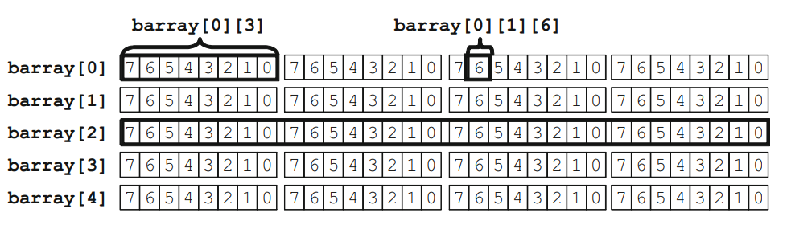

## SystemVerilog Data Types

We can basically group SV data types as 4-state variable and 2-state variable.

4-State variables: integer, logic, reg

2-State variables: int, byte, longint, bit

### Arrays:

#### Fixed-Size Array:

```
int arr1 [0:31];            // 32 ints [0]...[31]
int arr2 [32];              // 32 ints [0]...[31] 
```

Declaring an array with parameters:

```
parameter MEM_SIZE    = 64;
parameter ADDR_WIDTH  = $clog2(MEM_SIZE);           // log2(64) = 6

bit [63:          0]  mem     [MEM_SIZE];
bit [ADDR_WIDTH-1:0]  addr;
```

Initializing arrays:
```
initial begin
  static int arr[4]   = '{0,1,2,3,4};           // Initialize 4 elements
  
  arr[0:2]            = '{1,2,3};               // Set just first 3 elements
  arr                 = '{4{8}};                // All elements will become 8
  arr                 = '{default:8};           // All elements will become 8
end
```

:memo: **Note**: Notice that, the declaration of the array includes an initial value. When we don't use initial value, we must not declare the array with static. The 2009 LRM states that these variables must be declared either in a static block, or have the static keyword. Since this experts recommends always declaring your test modules and programs as automatic , you need to add the static keyword to a declaration plus initialization when it is inside an initial block.

##### 1-) Multi-dimensional Arrays

```
int array1 [0:1][0:2];                          // verbose declaration
int array2 [2][3] = `{`{0,1,2},`{3,4,5}};       // compact declaration and initializing
array2[1][2] = 1;                               // set last array element
```

You can also use some loops (eg. foreach, for etc.) to initialize arrays.

:memo: **Note**: If your code accidently tries to read from an out of bounds address, SV will return the default value for the array element type.

Default value for 4-State variables is "x".
Default value for 2-State variables is "0".

Comparing arrays is possible checking operations (eg. "==", "!=").

To perform some arithmetic such ass addition or division, we can use loops.

##### 2-) Unpacked Array:

```
bit [7:0] b_unpack [3];
```

Why is it named as unpacked?

Because some of the parts in memory cannot be used.


##### 3-) Packed Array:

```
bit [3:0][7:0] bytes;             // 4 bytes packed into 32-bits
bytes = 32'hCAFE_DADA;

$displayh(bytes,,                 // Show all 32-bits
          bytes[3],,              // "CA"
          bytes[3][7]);           // Most significant bit "1" of "CA"
```


##### 3-) Mixed Packed/Unpacked Array:

```
bit [3:0][7:0] marray [5];
```



#### non-Fixed Size Arrays

##### 1-) Dynamic Arrays

It is not fixed size array. Its size is determined, after using new constructor.

```
int dyn_arr[];
initial begin
  dyn_arr = new[5];
end
```

Initializing dynamic array example:
```
bit [7:0] mask [] = `{8'b0000_00011, 8'b0010_0101};
```

Multi-dimension example:

```
int d[][];
initial begin
  dyn_arr = new[5];

  foreach(d[i])
    d[i] = new[i+1];
end
```

##### 2-) Queues Arrays

Like linked list, you can add or remove elements anywhere in a queue.

```
int j=1;
int q2[$] = {3,4};  // don't use ' when initializing
int q[$] = {0,2,3};

initial begin
  q.insert(1,j);    // {0,1,2,3}    Insert j before element #1
  q.delete(1);      // {0,2,3}      Delete element #1

  q.push_front(6);  // {6,0,2,3}    Insert the value front
  j = q.pop_back;   // {6,0,2}      j = 3

  q.delete();       // delete queue
end
```

:memo: **Note**: You can not assign a queue to another queue. But you can copy dynamic array or fixed array to queue.

##### 3-) Associative Arrays

Dynamic arrays are good if you want to occasionally create a big array, but what if you want something really large? Perhaps you are modeling a processor that has a multi-gigabyte address range.

During a typical test, the processor may only touch a few hundred or thousand memory locations containing executable code and data, so allocating and initializing gigabytes of storage is wasteful. 

In an example: Just think an array that you don't use the addresses of this array.

```
  byte assoc [byte];      // notice that there is data type in parantheses
  initial begin
    assoc[100] = 1;
    assoc[50]  = 2;

    foreach(assoc[i])
      $display("assoc[%h] = %h", i, assoc[i]);
    
  end
```

Output will be:
```
assoc[100] = 1;
assoc[50]  = 2;
```

Another initializing method:
```
  int aa[int] = `{0:1, 10:4};   // aa[0] = 1 and aa[10] = 4
```

Some of the array's methods:

- sum()
- product()
- and()
- min()
- max()
- unique() // takes once repeated elements
- reverse()
- sort()
- rsort()
- shuffle() 
- find_index with (item > 3) // finds the elements' indexes that are greater than 3

Random elemen choosing:

```
$urandom_range($size(arr)-1);
```